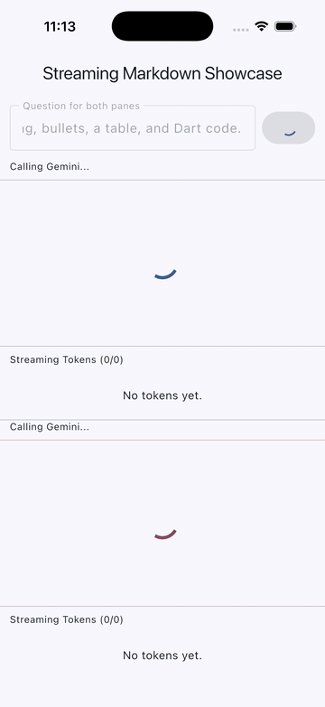

<a id="readme-top"></a>

[![Contributors][contributors-shield]][contributors-url]
[![Forks][forks-shield]][forks-url]
[![Stargazers][stars-shield]][stars-url]
[![Issues][issues-shield]][issues-url]
[![License][license-shield]][license-url]
[![Pub Version][pub-shield]][pub-url]

<br />
<div align="center">
  <a href="https://github.com/samnn152/streaming-markdown">
    
  </a>

<h3 align="center">animated_streaming_markdown</h3>

  <p align="center">
    Streaming Markdown parser + renderer for Flutter, optimized for incremental append flows.
    <br />
    <a href="https://samnn.dev"><strong>Explore the docs »</strong></a>
    <br />
    <br />
    <a href="https://github.com/samnn152/streaming-markdown/tree/main/example">View Demo</a>
    &middot;
    <a href="https://github.com/samnn152/streaming-markdown/issues/new?labels=bug">Report Bug</a>
    &middot;
    <a href="https://github.com/samnn152/streaming-markdown/issues/new?labels=enhancement">Request Feature</a>
  </p>
</div>

<p align="center">
  <a href="https://pub.dev/packages/animated_streaming_markdown">
    
  </a>
</p>

<details>
  <summary>Table of Contents</summary>
  <ol>
    <li>
      <a href="#about-the-project">About The Project</a>
      <ul>
        <li><a href="#built-with">Built With</a></li>
      </ul>
    </li>
    <li>
      <a href="#getting-started">Getting Started</a>
      <ul>
        <li><a href="#prerequisites">Prerequisites</a></li>
        <li><a href="#installation">Installation</a></li>
      </ul>
    </li>
    <li><a href="#usage">Usage</a></li>
    <li><a href="#documentation">Documentation</a></li>
    <li><a href="#roadmap">Roadmap</a></li>
    <li><a href="#contributing">Contributing</a></li>
    <li><a href="#license">License</a></li>
    <li><a href="#contact">Contact</a></li>
    <li><a href="#acknowledgments">Acknowledgments</a></li>
  </ol>
</details>

## About The Project

`animated_streaming_markdown` provides 2 main layers:

- **Parser**: `MarkdownStreamParser` for typed `replace`/`append` requests
- **Renderer**: `AnimatedStreamingMarkdown` for block rendering + token reveal animations

It is designed for chat-like or streaming text interfaces where markdown arrives progressively and needs stable UI updates.

<p align="right">(<a href="#readme-top">back to top</a>)</p>

### Built With

* [![Flutter][Flutter-badge]][Flutter-url]
* [![Dart][Dart-badge]][Dart-url]
* [![Tree-sitter][TreeSitter-badge]][TreeSitter-url]

<p align="right">(<a href="#readme-top">back to top</a>)</p>

## Getting Started

### Prerequisites

- Flutter `>=3.0.0`
- Dart SDK `>=2.17.0 <4.0.0`
- Native toolchain for your target platform (Android/iOS/macOS/Linux/Windows)

### Installation

1. Add dependency:
   ```yaml
   dependencies:
    animated_streaming_markdown: ^0.3.3
   ```
2. Install packages:
   ```sh
   flutter pub get
   ```

<p align="right">(<a href="#readme-top">back to top</a>)</p>

## Usage

### 1) Start parser worker and stream markdown

```dart
final parser = MarkdownStreamParser();
await parser.start();

final setResult = await parser.replace('# Hello');

final appendResult = await parser.append('\n\nStreaming **markdown** chunk...');
```

### 2) Render blocks with `AnimatedStreamingMarkdown`

```dart
AnimatedStreamingMarkdown(
  blocks: appendResult.blocks,
  asSliver: true,
  tokenStaggerDelay: const Duration(milliseconds: 180),
  tokenAnimationDuration: const Duration(milliseconds: 240),
  enableSelection: true,
  tokenAnimationBuilder: (
    BuildContext context,
    AnimatedMarkdownToken token,
  ) {
    final t = Curves.easeOutCubic.transform(token.value);
    return Transform.translate(
      offset: Offset(0, (1 - t) * 8),
      child: Opacity(opacity: t, child: token.child),
    );
  },
);
```

### 3) Important APIs

- `MarkdownStreamParser.start()`
- `MarkdownStreamParser.replace(markdown)`
- `MarkdownStreamParser.append(chunk)`
- `MarkdownStreamParser.parse(operation, text)`
- `MarkdownStreamParser.dispose()`
- `MarkdownSyncParser.parseMarkdown(markdown)`
- `warmUpStreamingMarkdownParser(includeWorker: true)`
- `AnimatedStreamingMarkdown(...)`
- `AnimatedStreamingMarkdown.fromMarkdown(...)`
  - `blocks`
  - `asSliver`
  - `tokenStaggerDelay`
  - `tokenAnimationDuration` / `tokenAnimationDurationFactor`
  - `tokenAnimationBuilder`
  - `onTokenDelay`
  - `enableSelection`
  - `blockBuilder`

For a complete integration sample, check [`example/lib/src/demos/markdown_cases_demo.dart`](example/lib/src/demos/markdown_cases_demo.dart).

## Documentation

- [Documentation site](https://samnn.dev)
- [Package page](https://pub.dev/packages/animated_streaming_markdown)
- [Generated API reference](https://pub.dev/documentation/animated_streaming_markdown/latest/)
- [Example app](https://github.com/samnn152/streaming-markdown/tree/main/example)
- [Migration guide: 0.2.x to 0.3.x](docs/migration-0-3.mdx)

The documentation site is built with Docusaurus from [`docs/`](docs) and
deployed to GitHub Pages by [`Deploy Documentation`](.github/workflows/docs-pages.yml).

Run the docs site locally:

```sh
cd website
npm ci
npm run start
```

Build the static site:

```sh
cd website
npm run build
```

### Migration notes for 0.3.0

`0.3.0` keeps the `0.2.x` API available, but the preferred names now describe
the package behavior more directly:

| 0.2.x name | 0.3.x preferred name |
| --- | --- |
| `StreamingMarkdownParseWorker` | `MarkdownStreamParser` |
| `request(op: 'set', ...)` | `replace(markdown)` |
| `request(op: 'append', ...)` | `append(chunk)` |
| `StreamingMarkdownParseResult.renderNodes` | `MarkdownParseResult.blocks` |
| `StreamingMarkdownRenderView` | `AnimatedStreamingMarkdown` |
| `nodes` | `blocks` |
| `sliver` | `asSliver` |
| `tokenArrivalDelay` | `tokenStaggerDelay` |
| `tokenFadeInDuration` | `tokenAnimationDuration` |
| `tokenFadeInRelativeToDelay` | `tokenAnimationDurationFactor` |
| `allowUnclosedInlineDelimiters` | `allowIncompleteInlineSyntax` |
| `enableTextSelection` | `enableSelection` |
| `customBlockBuilder` | `blockBuilder` |
| `markdownTheme` | `theme` |

<p align="right">(<a href="#readme-top">back to top</a>)</p>

## Roadmap

- Done: Incremental parser worker (`replace` / `append`)
- Done: Streaming renderer for markdown block nodes
- Done: Per-token custom animation builder API
- Done: Example with multiple animation presets
- Done: Docusaurus documentation site for `samnn.dev`
- Done: Convenience constructors and sync parser helpers
- Planned: Code block copy and LaTeX support research
- Planned: Richer copy modes and improved multi-content drag selection
- Planned: More parser/renderer benchmark scenarios

See the [open issues][issues-url] for proposed features and known issues.

<p align="right">(<a href="#readme-top">back to top</a>)</p>

## Contributing

Contributions are welcome.

1. Fork the project
2. Create your branch (`git checkout -b feature/your-feature`)
3. Commit your changes (`git commit -m "Add your feature"`)
4. Push branch (`git push origin feature/your-feature`)
5. Open a Pull Request

See [CONTRIBUTING.md](CONTRIBUTING.md) for local setup, repository layout, and
quality gates.

<p align="right">(<a href="#readme-top">back to top</a>)</p>

## License

Distributed under the Apache-2.0 License. See [`LICENSE`](LICENSE) for details.

<p align="right">(<a href="#readme-top">back to top</a>)</p>

## Contact

- Documentation: [https://samnn.dev](https://samnn.dev)
- API reference: [https://pub.dev/documentation/animated_streaming_markdown/latest/](https://pub.dev/documentation/animated_streaming_markdown/latest/)
- Repository: [https://github.com/samnn152/streaming-markdown](https://github.com/samnn152/streaming-markdown)
- Issues: [https://github.com/samnn152/streaming-markdown/issues](https://github.com/samnn152/streaming-markdown/issues)

<p align="right">(<a href="#readme-top">back to top</a>)</p>

## Acknowledgments

* [Tree-sitter](https://tree-sitter.github.io/tree-sitter/)
* [tree-sitter-markdown](https://github.com/tree-sitter-grammars/tree-sitter-markdown)
* [Flutter](https://flutter.dev/)

<p align="right">(<a href="#readme-top">back to top</a>)</p>

<!-- MARKDOWN LINKS & IMAGES -->
[contributors-shield]: https://img.shields.io/github/contributors/samnn152/streaming-markdown.svg?style=for-the-badge
[contributors-url]: https://github.com/samnn152/streaming-markdown/graphs/contributors
[forks-shield]: https://img.shields.io/github/forks/samnn152/streaming-markdown.svg?style=for-the-badge
[forks-url]: https://github.com/samnn152/streaming-markdown/network/members
[stars-shield]: https://img.shields.io/github/stars/samnn152/streaming-markdown?style=for-the-badge&logo=github&label=Stars
[stars-url]: https://github.com/samnn152/streaming-markdown/stargazers
[issues-shield]: https://img.shields.io/github/issues/samnn152/streaming-markdown.svg?style=for-the-badge
[issues-url]: https://github.com/samnn152/streaming-markdown/issues
[license-shield]: https://img.shields.io/github/license/samnn152/streaming-markdown.svg?style=for-the-badge
[license-url]: https://github.com/samnn152/streaming-markdown/blob/main/LICENSE
[pub-shield]: https://img.shields.io/pub/v/animated_streaming_markdown?style=for-the-badge
[pub-url]: https://pub.dev/packages/animated_streaming_markdown
[Flutter-badge]: https://img.shields.io/badge/Flutter-02569B?style=for-the-badge&logo=flutter&logoColor=white
[Flutter-url]: https://flutter.dev/
[Dart-badge]: https://img.shields.io/badge/Dart-0175C2?style=for-the-badge&logo=dart&logoColor=white
[Dart-url]: https://dart.dev/
[TreeSitter-badge]: https://img.shields.io/badge/Tree--sitter-2F2F2F?style=for-the-badge
[TreeSitter-url]: https://tree-sitter.github.io/tree-sitter/
